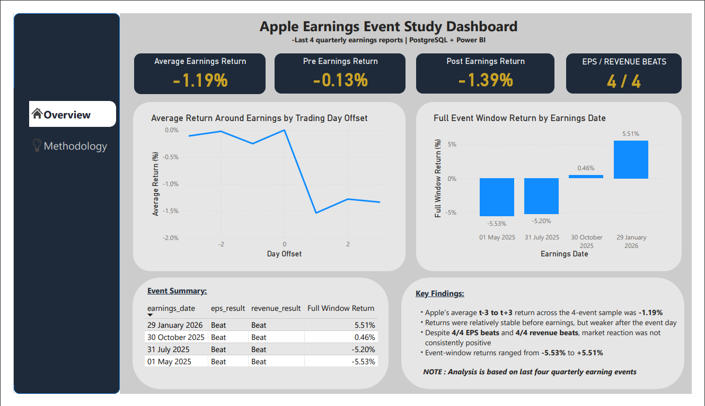
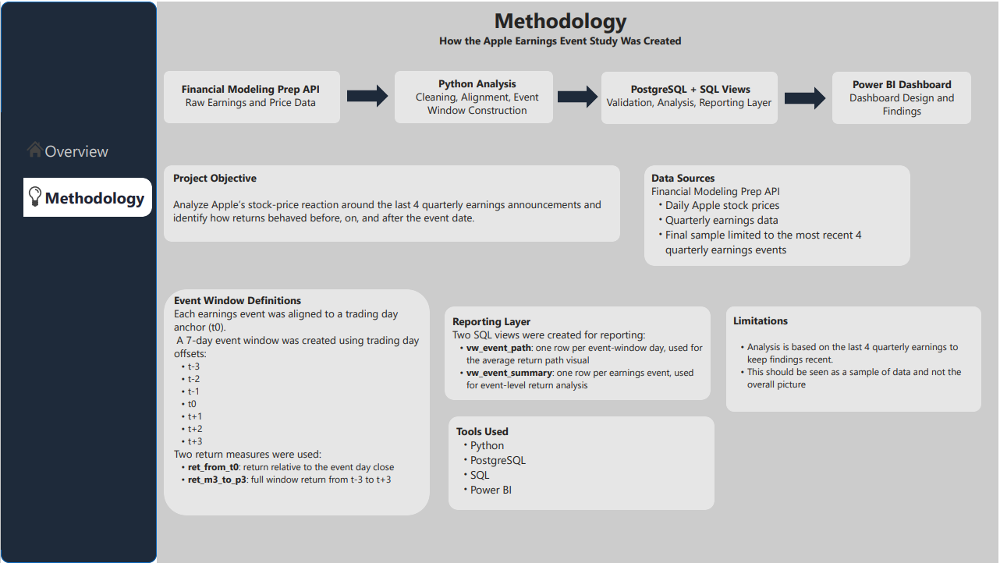

# Earnings Event Study (AAPL)

## Summary

Built an end to end data analytics project analysing the stock price reaction of a major tech company (Apple), around the last 4 quarterly earnings using the Financial Modelling Prep (FMP) API, Python, PostgreSQL, SQL and Power BI. 

## Tools Used:

- **Financial Modelling Prep API** for pulling stock and earnings data
- **Python** for data collection, cleaning, and event-window analysis
- **PostgreSQL / psql** for relational storage and querying
- **Power BI** for dashboarding and visualization

---

## Project Goal

The goal of this project is to identify and quantify market reactions to Apple earnings events by:

- pulling daily stock price data from a live API
- pulling quarterly earnings data from a live API
- aligning earnings dates to trading days
- calculating returns in an earnings event window
- storing the cleaned data in PostgreSQL
- visualizing the results in Power BI

---

## Workflow
**FMP API → Python transformation → PostgreSQL tables → SQL analysis/views → Power BI dashboard**


## Data Used

The project uses four main datasets:

- `aapl_prices.csv` — daily Apple stock price data
- `aapl_earnings.csv` — quarterly earnings data
- `aapl_event_window.csv` — one-row-per-event summary table
- `aapl_event_window_long.csv` — one-row-per-offset-day event path table

## Database Tables

### `prices_daily`
Raw daily stock-price table with:
- symbol
- date
- open / high / low / close
- volume
- vwap
- change
- change_percent

### `earnings`
Raw earnings-event table with:
- symbol
- earnings_date
- eps_actual
- eps_estimated
- revenue_actual
- revenue_estimated
- last_updated

### `event_window`
Summary event-study table with one row per earnings event, including:
- aligned event trading date (`t0`)
- close prices at `t-3`, `t0`, and `t+3`
- full-window return `ret_m3_to_p3`

### `event_window_long`
Long-format event-study table with one row per trading-day offset, including:
- `day_offset` from `t-3` to `t+3`
- `window_date`
- close
- `ret_from_t0`
- repeated full-window return `ret_m3_to_p3`

## SQL Layer

The SQL portion of the project was split into separate files:

- `sql/01_schema.sql` — database schema
- `sql/02_validation.sql` — row counts, date ranges, completeness checks
- `sql/03_analysis.sql` — analytical queries used to answer the business question
- `sql/04_views.sql` — reporting views for Power BI

## Reporting Views

Two SQL views were created for reporting:

- **`vw_event_summary`** — one row per earnings event, used for event-level analysis
- **`vw_event_path`** — one row per event-window day, used for return-path analysis

## Methodology

Each earnings event was aligned to a trading-day anchor (`t0`), and a 7-day event window was created using trading-day offsets:

- `t-3`
- `t-2`
- `t-1`
- `t0`
- `t+1`
- `t+2`
- `t+3`

Two return measures were used:

- **`ret_from_t0`** — return relative to the event-day close
- **`ret_m3_to_p3`** — full-window return from `t-3` to `t+3`

## Key Findings

- Apple’s average **t-3 to t+3** return across the 4-event sample was **-1.19%**
- Average return was **-0.13% before earnings** versus **-1.39% after earnings**
- **All 4 events beat EPS estimates**
- **All 4 events beat revenue estimates**
- Despite those positive earnings results, market reaction was **not consistently positive**
- Full event-window returns ranged from **-5.53%** to **+5.51%**

## Dashboard Preview

### Overview Page


### Methodology Page


## Repository Structure

```text
earnings-event-study/
│
├── data/
│   ├── raw/
│   └── processed/
│
├── sql/
│   ├── 01_schema.sql
│   ├── 02_validation.sql
│   ├── 03_analysis.sql
│   └── 04_views.sql
│
├── fetch_prices.py
├── fetch_earnings.py
├── analyze_event_window.py
├── build_event_window_long.py
├── README.md
└── requirements.txt
```


## How to Reproduce

1. Collect Apple price and earnings data from the Financial Modeling Prep API.
2. Run the Python scripts to clean and transform the data.
3. Load the processed CSV files into PostgreSQL.
4. Run:
   - `01_schema.sql`
   - `02_validation.sql`
   - `03_analysis.sql`
   - `04_views.sql`
5. Connect Power BI to PostgreSQL and use:
   - `vw_event_summary`
   - `vw_event_path`

## Limitations

This analysis uses only the **last 4 quarterly earnings events**, so the results should be interpreted as **A sample and not the full picture**.

## Future Improvements

Possible next steps include:

- expanding the sample to include more historical Apple earnings events
- comparing multiple companies instead of only Apple
- adding sector or market benchmark comparisons
- building reusable Power BI templates for future event-study projects

## Notes

The path of processed and raw datasets are generated locally and are intentionally ignored.

## Author

**Aran-Phul**